# Worked examples in the editor

Each rule in [`examples/rules`](../examples/rules) can be written in the Alert Rules webapp, from Add rule › From a data path. This page shows how: for each example, what it watches, which condition kind to pick and which fields to fill in, and the editor filled in. A rule saved this way is the same as its JSON file, field for field; [`test/panel/editor/examples.test.tsx`](../test/panel/editor/examples.test.tsx) enters each JSON file in the editor and checks the rule it saves. [Worked examples](rules.md#worked-examples) in the rule reference shows what each one raises and clears.

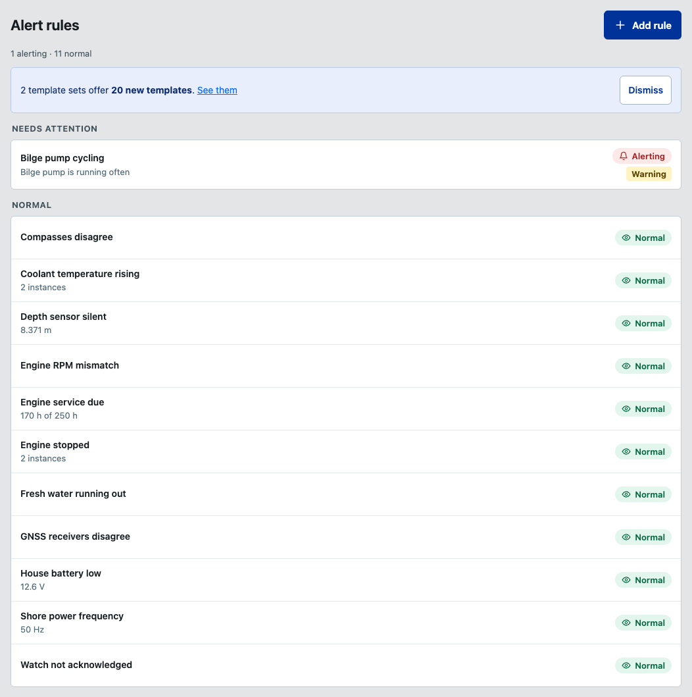

## Entering a rule

From a data path takes two steps: pick the value, then pick what about it should alert. The kinds that compare the value with a number are offered only for a numeric value; a boolean, a string or a position gets Stopped reporting, and the rest under More kinds.

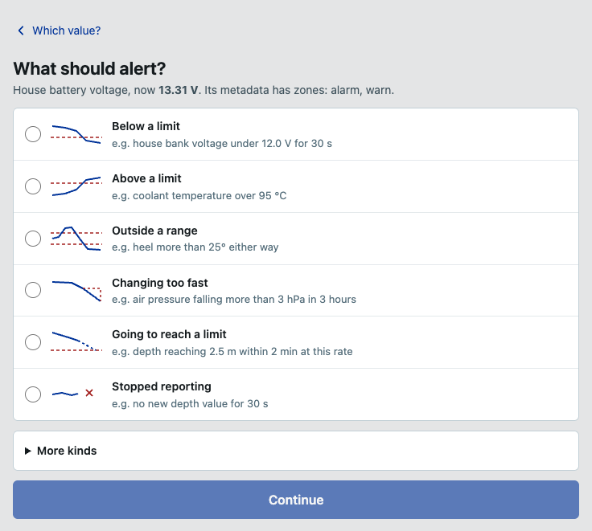

The editor then opens with the kind chosen, a name, a message and a condition name written from the value and the kind. The examples replace the name and the message with their own. A Message field left empty, on a new or a stored rule, saves the message written from the rule, shown in the field until a message is typed. The condition name, the field just above More options, follows the value and the kind until one is typed. The slug, under More options, follows the name until it is edited.

Numbers are typed in the display unit the server's unit preferences give the path, and stored in SI. The screenshots come from the webapp's render harness, which gives each path the display unit of Signal K's default nautical-metric preset, where:

| Quantity | Display unit | Example value typed | Stored |
|---|---|---|---|
| Engine revolutions | rpm | 180 rpm | 3 Hz |
| Rate of a temperature | °C/min | 1.2 °C/min | 0.02 K/s |
| Tank level | % | 5 % | 0.05 |
| Distance between positions | nmi | 0.026997840172786176 nmi | 50 m |
| Angle | ° | 5.729577951308232° | 0.1 rad |

The shore power frequency in the screenshots shows in Hz because the harness sets its path's display unit to the base unit, as a server's `displayUnits` for the path can; under the preset alone the server shows frequency in rpm. A limit that is a round number in SI but not in the display unit has to be typed in full to store exactly that number: 0.027 nmi stores 50.004 m. A stored rule opens with each converted number rounded as the rule detail shows values, 50 m as 0.027 nmi and 0.1 rad as 5.73°, and saves the stored number unchanged unless its field is edited.

Durations take a number and a unit (s, min or h) and are stored in seconds.

## House battery low

[`house-battery-low.json`](../examples/rules/house-battery-low.json) · [scenario](rules.md#worked-examples)

Warns when the house battery voltage stays in the `warn` zone of its metadata for 60 s, and climbs to alarm in the `alarm` zone. It clears once the voltage is 0.2 V back above the zone.

1. Value: `electrical.batteries.house.voltage`. Kind: **Below a limit**.
2. Name: `House battery low`. Message: `House battery voltage is low`.
3. For at least: 60 s.
4. More options: check **Use the value's zones**, starting at the zone `warn`. The editor lists the zones the path reports and the priority each alerts at; Priority and limit then says the steps come from the zones.
5. More options: Clear margin 0.2 V.

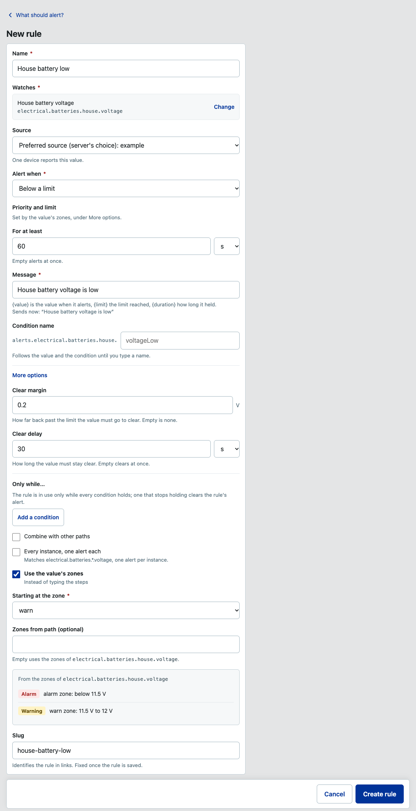

## Bilge pump cycling

[`bilge-pump-cycling.json`](../examples/rules/bilge-pump-cycling.json) · [scenario](rules.md#worked-examples)

Warns when the bilge pump starts more than four times within an hour.

1. Value: `electrical.switches.bilgePump.state`. Kind: More kinds › **Happening too often**.
2. Name: `Bilge pump cycling`. Message: `Bilge pump is running often`.
3. Count each time the value: **changes to** `true`.
4. Within: 1 h.
5. Priority and limit: Warning, more than 4.

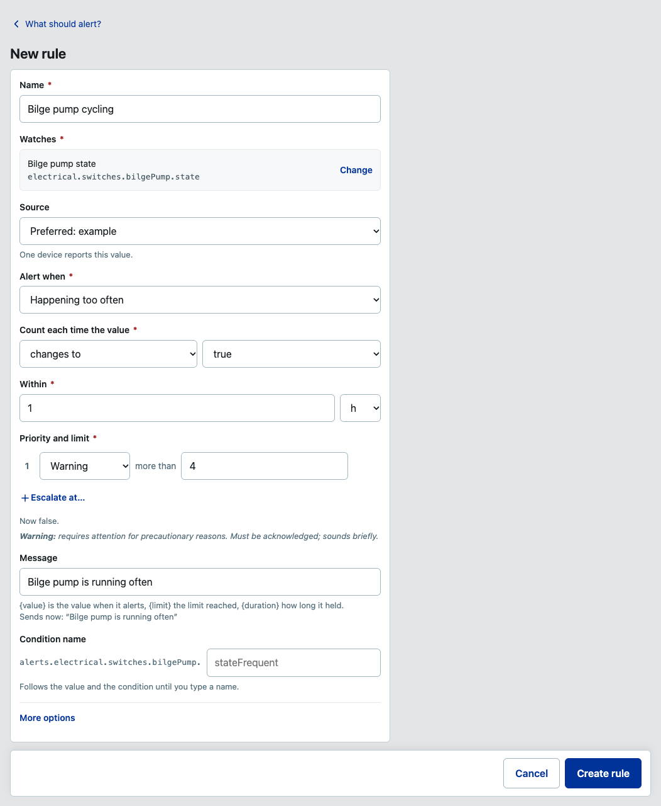

The rule detail of an alerting rule shows its message, how long it has alerted and the count now.

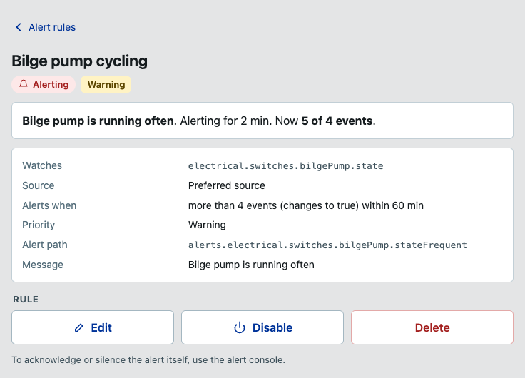

## Engine service due

[`engine-service-due.json`](../examples/rules/engine-service-due.json) · [scenario](rules.md#worked-examples)

Raises a caution once the main engine has run for 250 hours. It has no reset condition, so it never clears on its own.

1. Value: `propulsion.main.revolutions`. Kind: More kinds › **Running too long in total**.
2. Name: `Engine service due`. Message: `Engine service is due`.
3. Total of: **Time**.
4. Check **Only while the value is…**: above 0 rpm.
5. Priority and limit: Caution, at a total of 250 h.

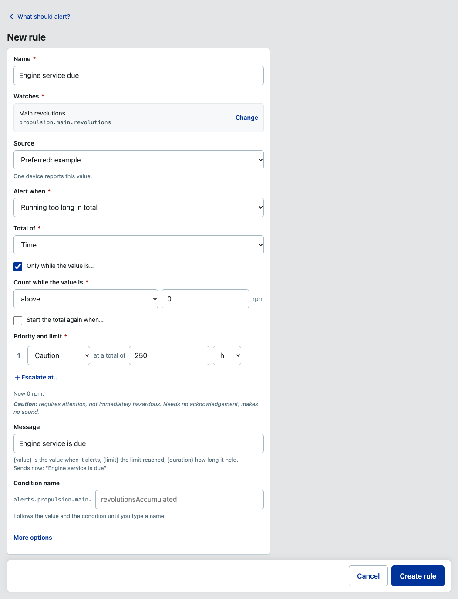

## Coolant temperature rising

[`coolant-temperature-rising.json`](../examples/rules/coolant-temperature-rising.json) · [scenario](rules.md#worked-examples)

Warns, for each engine, when its coolant temperature rises faster than 0.02 K/s over 5 min, only while that engine turns faster than 5 Hz.

1. Value: `propulsion.port.coolantTemperature`. Kind: **Changing too fast**.
2. More options: check **Every instance, one alert each**. The value becomes `propulsion.*.coolantTemperature`, with one alert per engine.
3. Name: `Coolant temperature rising`. Message: `Coolant temperature is rising fast on {instance}`.
4. Changing: **Rising**. Over the last: 5 min.
5. Priority and limit: Warning, faster than 1.2 °C/min.
6. More options › Only while…: **Add a condition**. Input path `propulsion.port.revolutions`, then check **Match all instances**, which makes it `propulsion.*.revolutions`: each engine's rule is gated on that engine's revolutions. Holds while the input is above 300 rpm.

The condition name follows the value and the kind once Changing is chosen: `coolantTemperatureRising`.

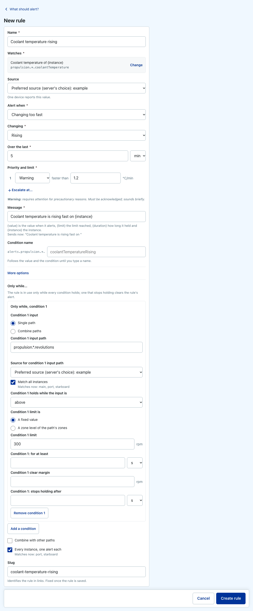

The rule detail lists each instance with its value and condition.

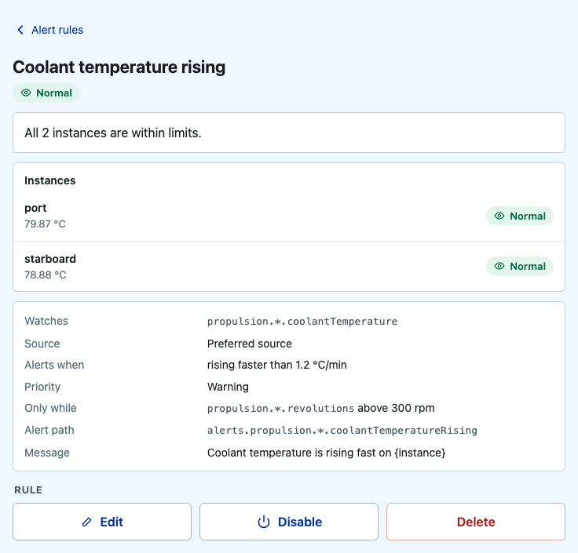

## Fresh water running out

[`fresh-water-running-out.json`](../examples/rules/fresh-water-running-out.json) · [scenario](rules.md#worked-examples)

Raises a caution when the fresh water tank, on its trend over the last 30 min, reaches 5 % within 2 h.

1. Value: `tanks.freshWater.0.currentLevel`. Kind: **Going to reach a limit**.
2. Name: `Fresh water running out`. Message: `Fresh water tank will be empty soon`.
3. Heading: **Falling**. Trend over the last: 30 min. Reaching the limit within: 2 h.
4. Priority and limit: Caution, reaching 5 %.

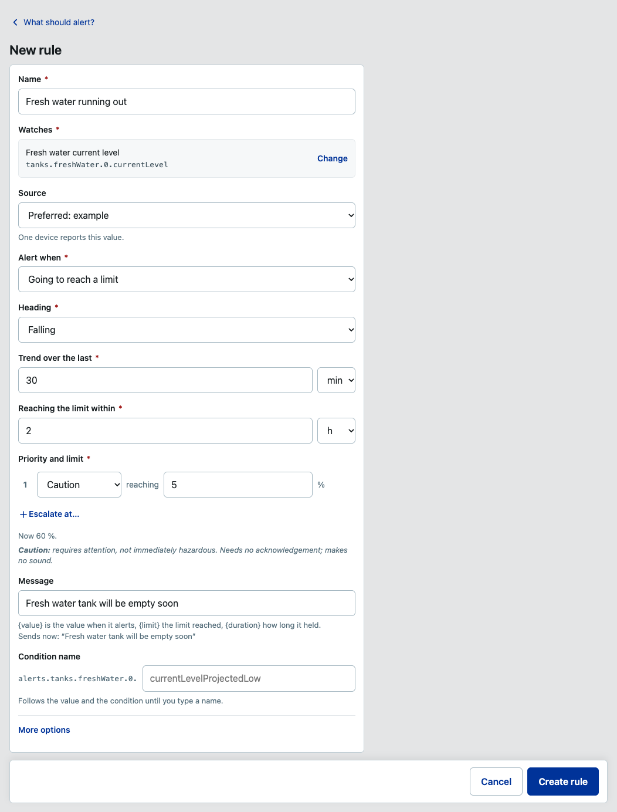

## Engine RPM mismatch

[`engine-rpm-mismatch.json`](../examples/rules/engine-rpm-mismatch.json) · [scenario](rules.md#worked-examples)

Raises a caution when the port and starboard engine speeds differ by more than 3 Hz for 30 s, only while both engines have turned faster than 8 Hz for 10 s.

1. Value: `propulsion.port.revolutions`. Kind: **Above a limit**.
2. More options: check **Combine with other paths**. Combination: **Absolute difference of two**. Combined path 1 is the value picked; combined path 2: `propulsion.starboard.revolutions`.
3. Name: `Engine RPM mismatch`. Message: `Port and starboard engine speeds differ`.
4. Priority and limit: Caution, above 180 rpm. For at least: 30 s.
5. Condition name: `revolutionsMismatch`. A combined signal has no default, so the field is required.
6. More options › Only while…: add two conditions, `propulsion.port.revolutions` and `propulsion.starboard.revolutions`, each above 480 rpm, for at least 10 s.

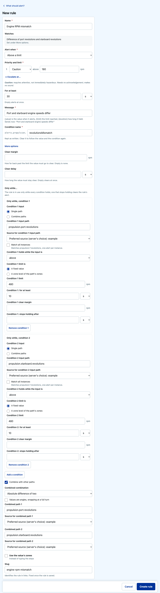

The rule detail names the combination and its inputs, and each condition the rule is gated on, with its limit.

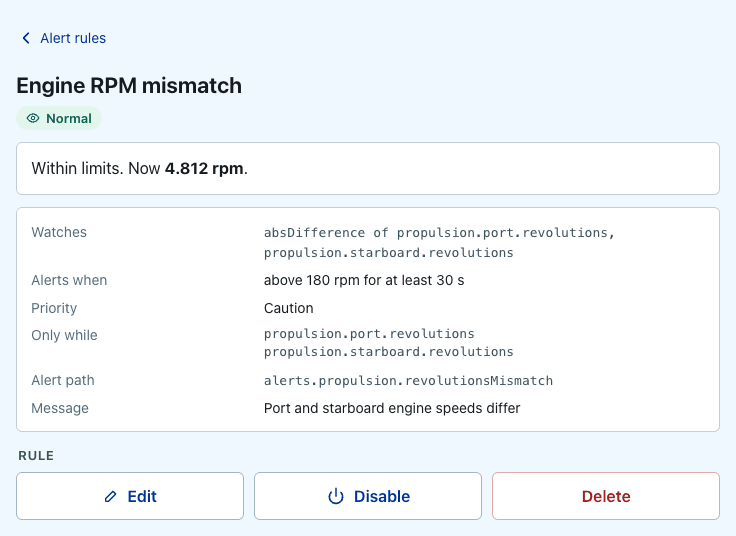

## GNSS receivers disagree

[`gnss-disagree.json`](../examples/rules/gnss-disagree.json) · [scenario](rules.md#worked-examples)

Warns when the positions of three named GNSS receivers spread more than 50 m apart for 20 s.

1. Value: `navigation.position`. A position is not a number, so the kind picker offers only Stopped reporting and More kinds; pick **Stopped reporting** to open the editor.
2. More options: check **Combine with other paths**. Combination: **Largest distance between positions**. Add path until there are three, each `navigation.position`, with the sources `gnss.bow`, `gnss.stern` and `gnss.mast`.
3. Alert when: **Above a limit**. The combined value is a distance, so every kind is now offered.
4. Name: `GNSS receivers disagree`. Message: `GNSS positions disagree`.
5. Priority and limit: Warning, above 50 m, typed in nmi as 0.026997840172786176; the rule opens again showing 0.027. For at least: 20 s.
6. Condition name: `gnssDisagree`. Slug: `gnss-disagree`, which differs from the one the name gives.

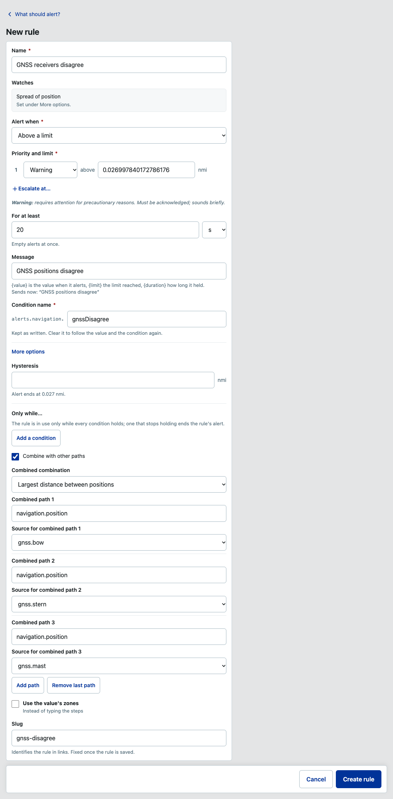

## Watch not acknowledged

[`watch-not-acknowledged.json`](../examples/rules/watch-not-acknowledged.json) · [scenario](rules.md#worked-examples)

Raises an alarm when the watch acknowledgement has not changed for 15 min.

1. Value: `navigation.watch.acknowledged`. Kind: More kinds › **Not happening**.
2. Name: `Watch not acknowledged`. Message: `No watch acknowledgement received`.
3. Expect the value to: **changes**.
4. Priority and limit: Alarm, none for 15 min.

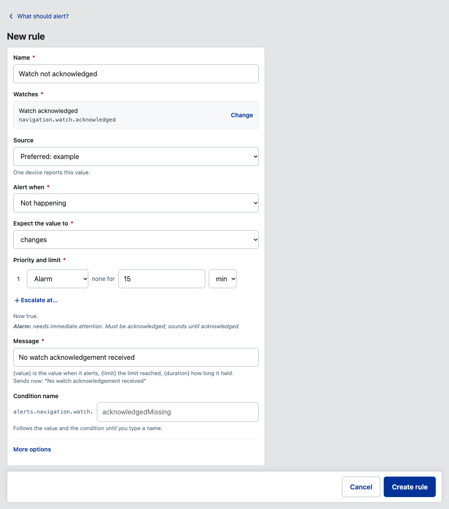

## Compasses disagree

[`compasses-disagree.json`](../examples/rules/compasses-disagree.json) · [scenario](rules.md#worked-examples)

Raises a caution when two named compasses differ by more than 0.1 rad for 60 s, measured across north: 358° and 3° are 5° apart.

1. Value: `navigation.headingMagnetic`. Kind: **Above a limit**.
2. More options: check **Combine with other paths**. Combination: **Absolute difference of two**. Combined path 2: `navigation.headingMagnetic`. Sources: `compass.a` and `compass.b`.
3. Check **Values are angles, wrapping at a full turn**.
4. Name: `Compasses disagree`. Message: `Compass headings disagree`.
5. Priority and limit: Caution, above 0.1 rad, typed in degrees as 5.729577951308232; the rule opens again showing 5.73. For at least: 60 s.
6. Condition name: `compassesDisagree`.

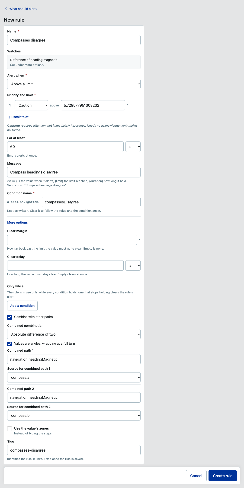

## Engine stopped

[`engine-stopped.json`](../examples/rules/engine-stopped.json) · [scenario](rules.md#worked-examples)

Warns once each time an engine's state changes to `stopped`, and keeps the alert until it is acknowledged.

1. Value: `propulsion.port.state`. Kind: More kinds › **A given state**.
2. More options: check **Every instance, one alert each**, which makes the value `propulsion.*.state`.
3. Name: `Engine stopped`. Message: `Engine {instance} stopped`.
4. The value: **changes to**. Priority and state: Warning, `stopped`.
5. More options: check **Keep the alert until acknowledged**. It is offered only for a kind whose condition is an event.

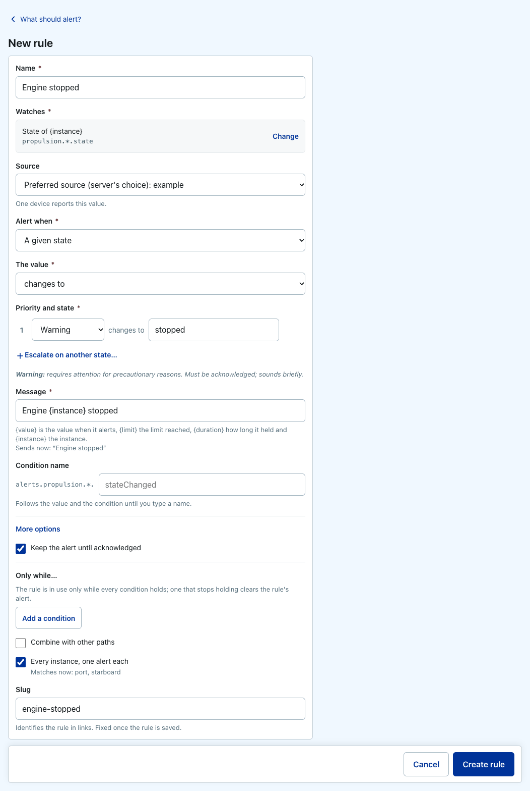

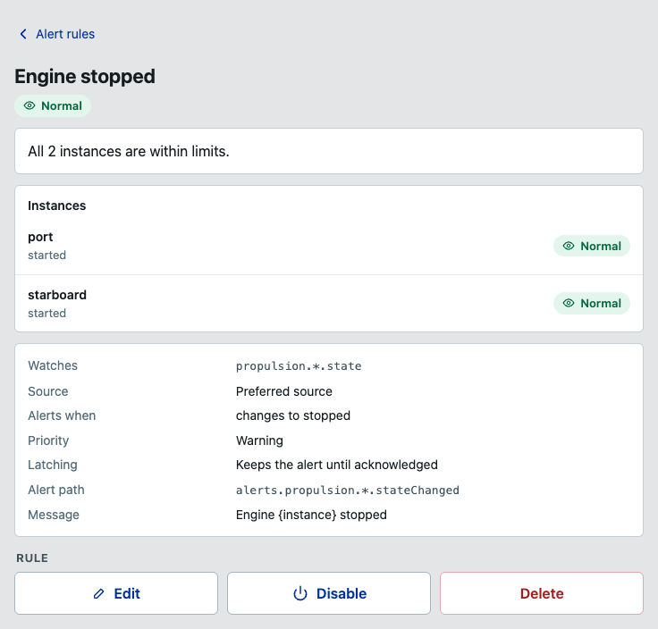

## Depth sensor silent

[`depth-sensor-silent.json`](../examples/rules/depth-sensor-silent.json) · [scenario](rules.md#worked-examples)

Warns when the depth has been timed out for 30 s.

1. Value: `environment.depth.belowTransducer`. Kind: **Stopped reporting**.
2. Name: `Depth sensor silent`. Message: `No depth data`.
3. Priority and limit: Warning. Silent for at least: 30 s.

The rule relies on the server marking the path timed out. On a server that does not enforce data timeouts the rule list shows it as a problem: "The server does not enforce timeouts".

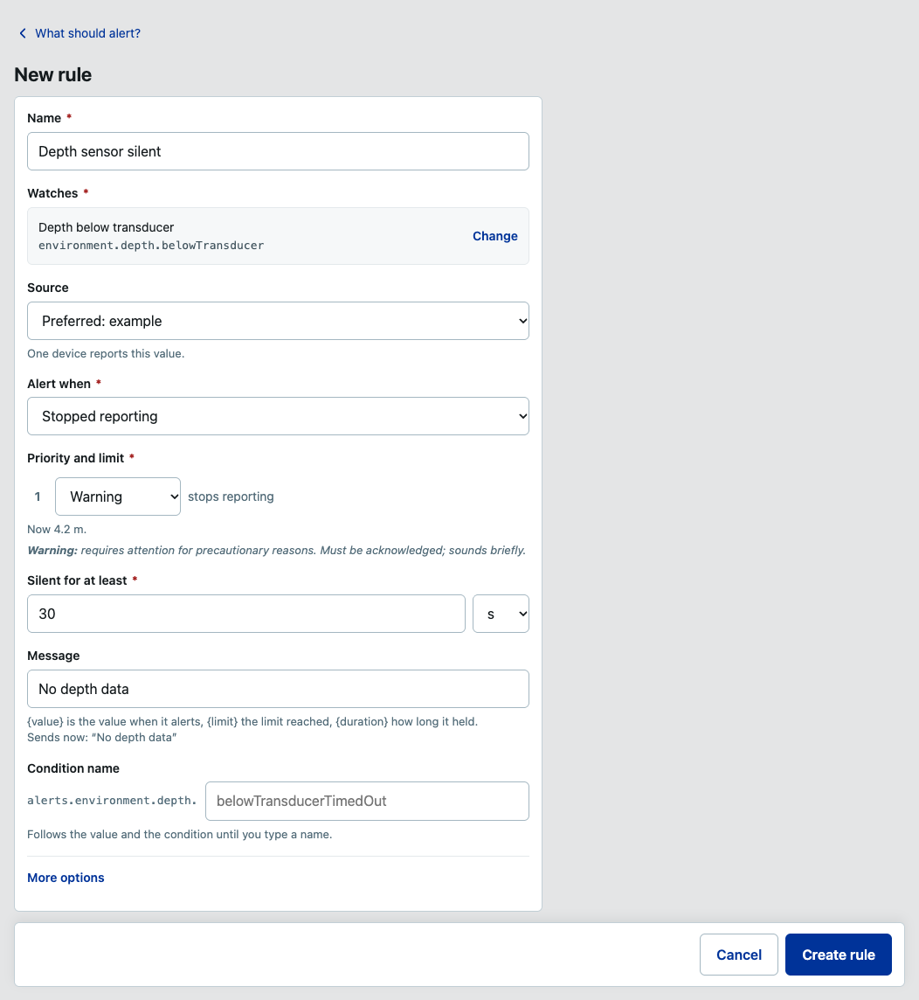

## Shore power frequency

[`shore-power-frequency.json`](../examples/rules/shore-power-frequency.json) · [scenario](rules.md#worked-examples)

Warns when the shore power frequency is outside 49-51 Hz for 10 s, and climbs to alarm outside 48-52 Hz. It clears once the frequency is 0.2 Hz inside 49-51 Hz.

1. Value: `electrical.ac.shore.phase.single.frequency`. Kind: **Outside a range**.
2. Name: `Shore power frequency`. Message: `Shore power frequency beyond {limit}: {value}`.
3. Priority and limit: Warning, outside 49 to 51 Hz. **Escalate at…** adds step 2: Alarm, outside 48 to 52 Hz.
4. Each step must hold for at least: 10 s.
5. More options: Clear margin 0.2 Hz.

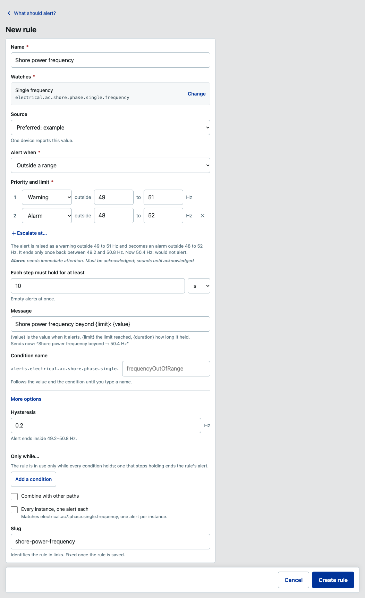

The rule detail shows the steps the alert climbs, and where the value must be back for the alert to clear.

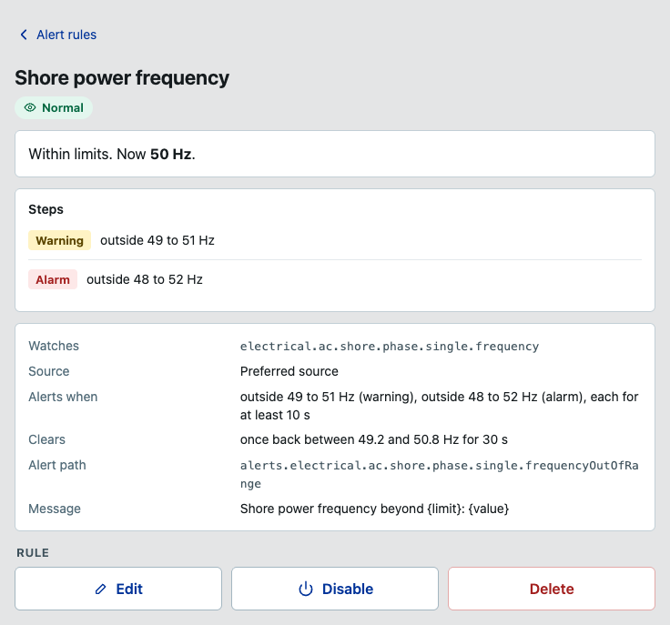
